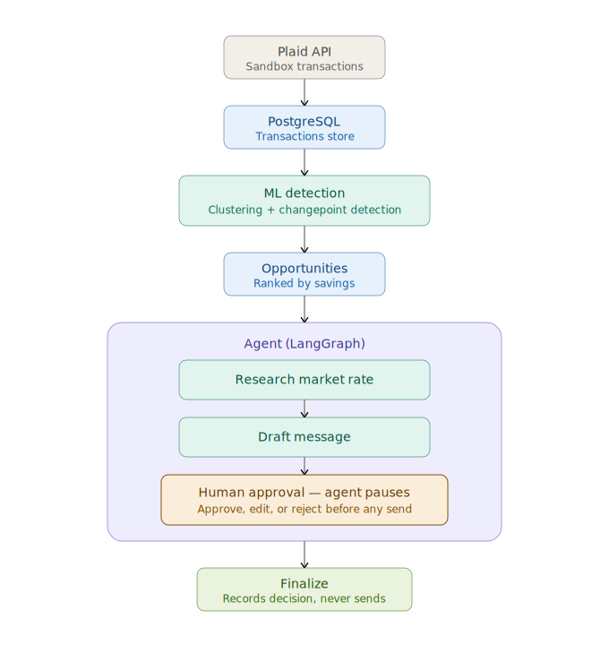

# Personal Finance Negotiation Agent

An agentic AI system that detects recurring subscriptions, price creep, and billing anomalies from real transaction data, then drafts negotiation and cancellation messages for human review. The agent researches, reasons, and drafts — but **never sends anything**. Every money-adjacent action stays under human control.

> Built end-to-end: data ingestion → ML detection → an agent with human-in-the-loop approval → a review dashboard → an evaluation harness.

---

## Why this project

Most "AI agent" demos wire a model directly to an action and hope for the best. This one is built the way a system that touches your money actually should be: it does the analysis and drafting autonomously, then **stops and waits for a human** before anything irreversible happens. The result demonstrates the things that matter in production agentic systems — orchestration, grounding, safety design, observability, and measured accuracy.

---

## What it does

1. **Ingests transactions** from the Plaid API (sandbox), into a PostgreSQL store.
2. **Detects opportunities** with machine learning:
   - Recurring payments via unsupervised clustering (DBSCAN) on engineered rhythm features.
   - Price creep via changepoint detection over each merchant's amount history.
   - Correctly separates income (e.g. salary) from cancellable expenses.
3. **Ranks opportunities** by estimated annual savings and persists them.
4. **Runs an agent** (LangGraph) that, for a chosen opportunity:
   - Researches market/competitor pricing (Tavily web search).
   - Drafts a message — a *negotiation* for price increases, a *cancellation* for plain subscriptions — grounded in the real detected numbers.
   - **Pauses for human approval.** The human approves, edits, or rejects.
5. **Surfaces everything in a dashboard** (Streamlit) — a visual approval queue.

---

## Architecture

```
                ┌──────────────┐
   Plaid API ──▶│  Ingestion   │──▶ PostgreSQL (transactions)
                └──────────────┘
                       │
                       ▼
                ┌──────────────┐
                │ ML Detection │  DBSCAN (recurring) + changepoint (price creep)
                └──────────────┘
                       │
                       ▼
                PostgreSQL (opportunities, ranked by savings)
                       │
                       ▼
        ┌──────────────────────────────────┐
        │            Agent (LangGraph)     │
        │  load → research → draft →       │
        │     ┌───────────────────────┐    │
        │     │HUMAN APPROVAL (pause) │    │  ◀── agent never sends
        │     └───────────────────────┘    │
        │  → finalize                      │
        └──────────────────────────────────┘
                       │
                       ▼
              Streamlit approval dashboard
                       │
              LangSmith tracing (full reasoning path)
```

---

## Safety design

This is the core design principle, not an afterthought:



- **The agent never sends anything.** It drafts messages and records decisions; the human performs the actual send. Approved items are marked `approved_ready_to_send`, not "sent."
- **Human-in-the-loop on every money-adjacent action.** The LangGraph workflow *suspends* at an approval interrupt and cannot proceed until a human approves, edits, or rejects.
- **Grounded outputs.** Drafts cite the actual detected figures (e.g. the real prior and current price), not invented numbers.
- **Sandbox data only.** No real bank credentials; all transaction data is Plaid sandbox or a locally generated test dataset.

---

## Tech stack

| Layer | Tools |
|-------|-------|
| Data ingestion | Plaid API, SQLAlchemy, PostgreSQL (Docker) |
| ML detection | scikit-learn (DBSCAN), pandas, NumPy |
| Agent orchestration | LangGraph (state machine + human-in-the-loop interrupt) |
| Research | Tavily web search |
| Observability | LangSmith tracing |
| UI | Streamlit |
| Evaluation | Custom precision/recall harness |

---

## Results

Because the test dataset is designed with known ground truth, detection accuracy is measured directly:

| Detector | Precision | Recall | F1 |
|----------|-----------|--------|-----|
| Recurring-payment detection | 1.00 | 1.00 | 1.00 |
| Price-creep detection | 1.00 | 1.00 | 1.00 |

*100% precision and recall on the labeled test set validates the detection logic. Real-world data would introduce edge cases (irregular billing dates, merchant-name variation) — expanding the evaluation set to cover these is the natural next step.*

---

## Project structure

```
finance-agent/
├── ingestion/      # Plaid integration, DB models, transaction sync, seed data
├── detection/      # Recurring + price-creep detection, opportunity pipeline
├── agent/          # LangGraph agent: state, nodes, research, draft, graph, runner
├── ui/             # Streamlit approval dashboard + service layer
├── evals/          # Detection evaluation harness
├── docker-compose.yml
└── requirements.txt
```

---

## Running it

**Prerequisites:** Python 3.11+, Docker, and free API keys for Plaid (sandbox), Tavily, and LangSmith.

```bash
# 1. Setup
python3 -m venv .venv && source .venv/bin/activate
pip install -r requirements.txt
cp .env.example .env          # then fill in your API keys

# 2. Start the database
docker compose up -d

# 3. Load data and run detection
python -m ingestion.seed_direct     # load the test dataset
python -m detection.run             # detect + rank opportunities

# 4. Run the agent (CLI)
python -m agent.run

# 5. Or use the dashboard
python -m streamlit run ui/app.py

# 6. Evaluate detection accuracy
python -m evals.test_detection
```

---

## Design decisions & notes

- **Template-based drafting with an LLM seam.** The drafting node currently uses structured templates grounded in the detected data. `agent/draft.py`'s `build_message()` is the single point to swap in a live LLM call (the research findings are already in agent state, ready to weave in).
- **Idempotent ingestion.** Transactions use Plaid's `transaction_id` as the primary key, so re-syncing updates rather than duplicates.
- **Direct seed loader.** Plaid sandbox backfills history asynchronously and unreliably for deep history; a direct loader guarantees the deterministic test dataset while the live Plaid path remains validated for recent transactions.

---

## Possible extensions

- Swap template drafting for a live LLM to weave specific research findings into each message.
- Add an optional send step, gated behind a second explicit human confirmation.
- Expand the evaluation set with messy, real-world-style transactions.
- Multi-account support and richer categorization via merchant-name embeddings.
